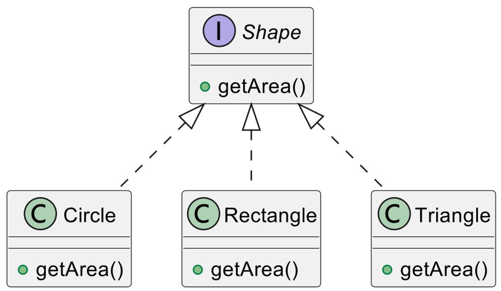

# 1. 도형의 면적 구하는 프로그램

### 아래 계층 구조를 구현하여 도형의 면적을 구하는 프로그램을 작성해주세요. 
각 도형 클래스에서는 getArea() 메소드를 오버라이딩하여 해당 도형의 넓이를 계산합니다.  
테스트 데이터를 다양하게 넣고 검증해주세요.

- Shape 인터페이스 : getArea() 메서드를 선언합니다.
- Circle 클래스 : Shape 인터페이스를 구현합니다. 반지름을 멤버 변수로 가집니다.
- Rectangle 클래스 : Shape 인터페이스를 구현합니다. 가로와 세로를 멤버 변수로 가집니다.
- Triangle 클래스 : Shape 인터페이스를 구현합니다. 밑변과 높이를 멤버 변수로 가집니다.